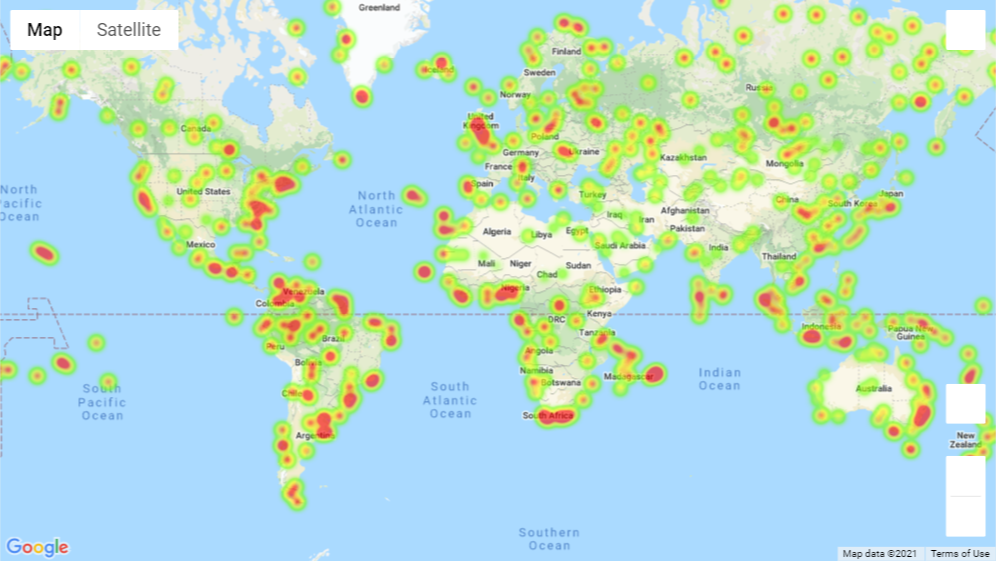

# WeatherPy and VacationPy
> Created by Dale Currigan, April 2021  
> Week six python-api-challenge


## Table of contents
* [General info](#general-info)
* [Screenshots](#Screenshots)
* [Setup](#setup)
* [Features](#features)
* [Status](#status)
* [Contact](#contact)

## General info
This project is in two parts:  
  
WeatherPy  
An analysis of weather characteristics as ones location approaches the equator. Using the OpenWeatherAPI, the temperature, humidity, cloud cover and wind speed are analysed for over 500 cities international cities (selected at random).

VacationPy  
Distribution of humidity data is mapped using the Google Maps API. Additionally, the Google Places API is utilised to find hotels close to cities with ideal weather characteristics.

The briefing note for the project was as follows:  
*Whether financial, political, or social -- data's true power lies in its ability to answer questions definitively. So let's take what you've learned about Python requests, APIs, and JSON traversals to answer a fundamental question: "What's the weather like as we approach the equator?"  
Now, we know what you may be thinking: "Duh. It gets hotter..."  
But, if pressed, how would you prove it?*  


## Screenshots
Some examples of the analyses generated by WeatherPy and VacationPy:  
  
* Scatter plot of temperature vs latitude:    
  

* Linear regression for humidity and latitude:  
  

* Humidity heatmap  


## Setup
* This Github repository contains contains 2 project folders (WeatherPy and VacationPy) containing the respective analyses 
* Open WeatherPy.ipynb or VacationPy.ipynb as a Jupyter Notebook
* Once either of the notebooks are opened, Select *Restart & Run All* from Kernel menu 
* The Notebook can now be navigated using the links to observe the data analysis
* An additional Output folder is also present in the repository, which contains images and data files generated by the analyses

## Features
The following analyses are included in *WeatherPy*:  

Scatter plots for -  
Temperature (F) vs. Latitude
Humidity (%) vs. Latitude
Cloudiness (%) vs. Latitude
Wind Speed (mph) vs. Latitude

Linear Regression -  
* Northern Hemisphere - Temperature (F) vs. Latitude
* Southern Hemisphere - Temperature (F) vs. Latitude
* Northern Hemisphere - Humidity (%) vs. Latitude
* Southern Hemisphere - Humidity (%) vs. Latitude
* Northern Hemisphere - Cloudiness (%) vs. Latitude
* Southern Hemisphere - Cloudiness (%) vs. Latitude
* Northern Hemisphere - Wind Speed (mph) vs. Latitude
* Southern Hemisphere - Wind Speed (mph) vs. Latitude

The following analyses are included in *VacationPy*:  
* Heatmap for humidity for all cities generated by WeatherPy
* Cities meeting ideal weather conditions
* Closest hotel (within 5000m) for each of these cities

## Status
Project is: 
````diff 
+ Completed
````

## Contact
Created by Dale Currigan - <dcurrigan@gmail.com>

